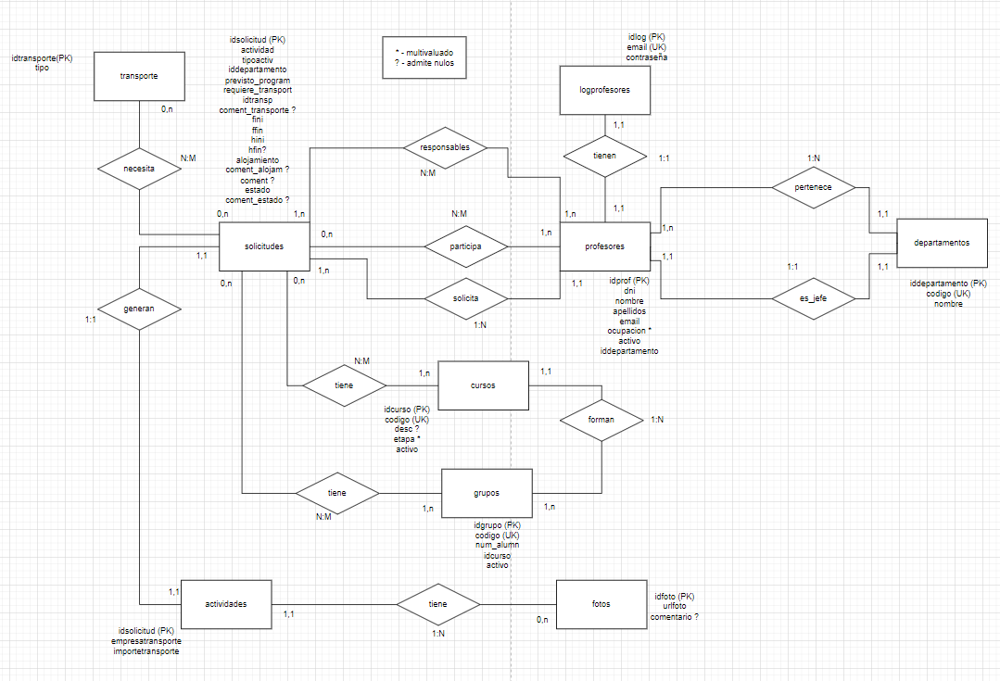

# DOCUMENTACION
## BASE DE DATOS:

La base de datos consiste en un login el cual compara email y password (md5)
Luego una vez dentro hay Profesores que son Jefes de un departamento,los profesores pueden solicitar las actividades de dos maneras,profesores responsables y profesores participantes
Cuando un profesor hace una solicitud,tiene que indicar que tipo de actividad es,informacion sobre el transporte, fecha de inicio y fin, si tiene alojamiento o no y
comentarios adicionales.
Tambien se almacena el estado de la solicitud y se gestionan los grupos y cursos que van
Las solicitudes aprobadas tienen fotos de la actividad

## PAGINA WEB

## PROGRAMACION
